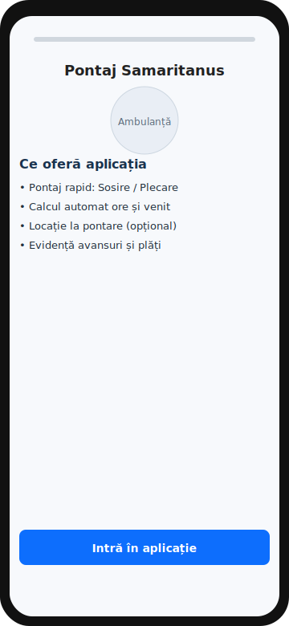
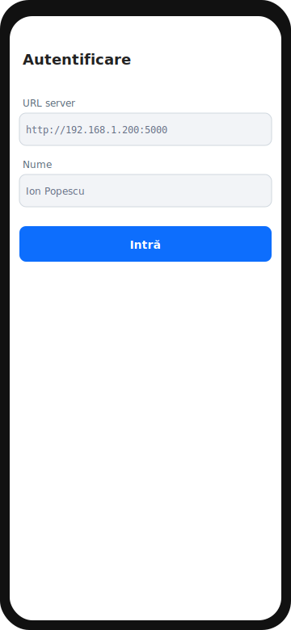
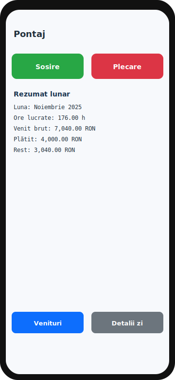
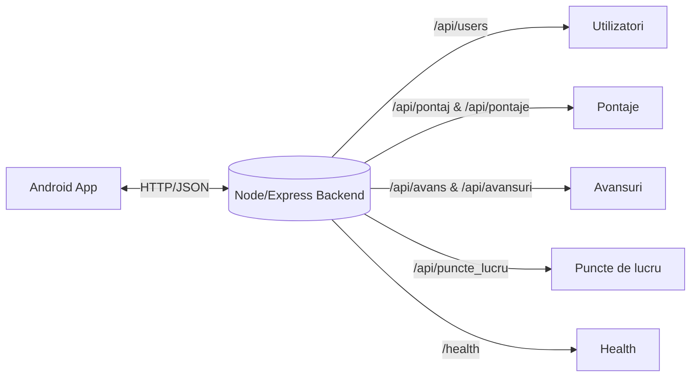

# Pontaj Samaritanus – prezentare rapidă

Vrei să vezi „grafic” cum arată aplicația? Mai jos ai o privire de ansamblu cu diagrame și hărți ale ecranelor. Poți deschide acest fișier direct pe GitHub – diagramele Mermaid sunt randate automat.

## Ecrane și navigare

```mermaid
flowchart TD
    A[Home – descriere funcționalități
    (activity_home.xml)] --> B[Login – URL server + nume
    (activity_login.xml)]
    B --> C[Main – Sosire / Plecare + rezumat
    (activity_main.xml)]
    C --> D[Earnings – venituri lunare
    (activity_earnings.xml)]
    C --> E[Day Detail – detalii tură + hartă
    (activity_day_detail.xml)]

    style A fill:#eef,stroke:#335
    style B fill:#eef,stroke:#335
    style C fill:#efe,stroke:#353
    style D fill:#ffe,stroke:#553
    style E fill:#fee,stroke:#533
```

 - Ecranul „Home” este prima pagină (launcher) și explică pe scurt ce face aplicația; butonul „Intră în aplicație” te duce la Login.
- După Login ajungi în „Main”, unde marchezi Sosire/Plecare și vezi sumarul.
- Din „Main” poți deschide „Earnings” (venituri) sau „Day Detail” (detalii pe zi).

### Previzualizări rapide (mock-uri, aspect pe telefon)

| Home | Login | Main |
|---|---|---|
|  |  |  |

## Flux de date (simplificat)



## Unde găsești layout-urile (design-ul ecranelor)

- `mobile-android/app/src/main/res/layout/activity_home.xml`
- `mobile-android/app/src/main/res/layout/activity_login.xml`
- `mobile-android/app/src/main/res/layout/activity_main.xml`
- `mobile-android/app/src/main/res/layout/activity_earnings.xml`
- `mobile-android/app/src/main/res/layout/activity_day_detail.xml`

Imaginile/culorile și textele se iau din:
- `mobile-android/app/src/main/res/values/strings.xml`
- `mobile-android/app/src/main/res/values/colors.xml`
- iconul e generat din `assets/logo512.png` (copiat automat la build ca `ic_launcher_foreground.png`).

## APK / build

În acest moment, build-urile automate pe push sunt puse pe pauză (rulează doar manual din Actions, la cerere), ca să putem face modificări. Când confirmi, pornesc eu manual build-ul și public APK-ul în Releases.

## Ce urmează

Spune-mi ce vrei să ajustăm la ecrane (texte, culori, elemente noi). Actualizez rapid layout-urile, împing pe repo și îți arăt rezultatul.
